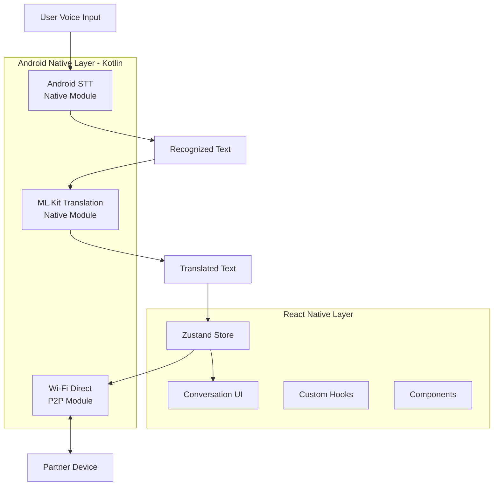

# Motara

> 100% 오프라인 실시간 음성 번역 앱 | Offline Real-time Voice Translation App

This project is submitted as a midterm development prototype.  
The goal is to demonstrate the architecture and progress of an offline real-time voice translation app rather than a fully completed production app.

이 프로젝트는 중간고사 개발 진행 결과물입니다.  
완성된 상용 앱이 아니라, 오프라인 실시간 음성 번역 앱의 구조와 현재 구현 상태를 보여주는 것을 목표로 합니다.

---

## 프로젝트 소개

Motara는 인터넷 연결이 없는 환경에서도 근거리 사용자 간 음성을 실시간으로 번역하여 대화할 수 있도록 설계한 오프라인 음성 번역 앱입니다.

Wi-Fi Direct P2P 통신을 기반으로 두 기기가 직접 연결되며, Android STT와 ML Kit Translation을 활용하여 완전한 오프라인 환경에서 동작합니다.

---

## 현재 개발 상태

| 기능 | 상태 | 설명 |
|---|---|---|
| 기본 UI | ✅ 완료 | 홈, 대화, 기록, 프로젝트 화면 구성 |
| 상태 관리 | ✅ 완료 | Zustand 기반 전역 상태 관리 |
| Android STT 구조 | 🔄 진행 중 | Native Module 및 Hook 구조 작성 완료 |
| ML Kit 번역 | 🔄 일부 완료 | 번역 모듈 및 Hook 구조 작성, 연동 테스트 중 |
| Wi-Fi Direct P2P | 🔄 진행 중 | P2P 연결 및 메시지 송수신 구조 개발 중 |
| 자동 P2P 얰결 | ❌ 미완성 | DNS-SD 자동 발견 안정화 필요 |
| STT Native 얰동 | ❌ 미완성 | 실제 음성 인식 호출 테스트 필요 |
| 양방향 번역 | ❌ 미완성 | 완전한 양방향 테스트 필요 |

---

## 시스템 구조도



---

## 기술 스택

| 구분 | 기술 |
|---|---|
| App Framework | React Native 0.76.9 |
| Language | TypeScript, Kotlin |
| State Management | Zustand |
| Speech Recognition | Android SpeechRecognizer (온디바이스) |
| Translation | Google ML Kit Translation (오프라인) |
| P2P Communication | Wi-Fi Direct (WifiP2pManager) |
| Storage | MMKV |
| Platform | Android |

---

## 지원 언어

한국어 · English · 日本語 · 中文 · Español · Français · Deutsch · العربية

---

## 폴더 구조

```
motara/
├── index.js
├── package.json
├── src/
│   ├── App.tsx
│   ├── components/        # 재사용 UI 컴포넌트
│   │   ├── BottomSheet.tsx
│   │   ├── CodeInput.tsx
│   │   └── Waveform.tsx
│   ├── hooks/             # STT, 번역 커스텀 훅
│   │   ├── useAndroidSTT.ts
│   │   └── useMLKitTranslate.ts
│   ├── screens/           # 주요 화면
│   │   ├── HomeScreen.tsx
│   │   ├── ConversationScreen.tsx
│   │   ├── ArchiveScreen.tsx
│   │   └── ProjectScreen.tsx
│   ├── store/
│   │   └── useAppStore.ts  # Zustand 전역 상태
│   └── theme/
│       └── colors.ts
└── motarav2/              # Android Native Modules (Kotlin)
    ├── MainActivity.kt
    ├── MainApplication.kt
    ├── SpeechModule.kt     # Android STT
    ├── SpeechPackage.kt
    ├── TranslateModule.kt  # ML Kit 번역
    └── TranslatePackage.kt
```

---

## 실행 방법

```bash
# 패키지 설치
npm install

# Metro 번들러 시작
npx react-native start

# Android 실행
npx react-native run-android
```

Android 기기 연결 확인:
```bash
adb devices
```

---

## 개발 중인 기능

- Wi-Fi Direct 자동 얰결 안정화 (DNS-SD 발견)
- STT Native Module 실제 호출 완전 통합
- 양방향 번역 메시지 송수신 안정화
- 다국어 조합 테스트 (한국어↔핀란드어, 중국어 등)
- 대화 기록 저장 기능

---

## 배운 점

- React Native와 Android Native Module (Kotlin) 연동 구조
- Wi-Fi Direct 기반 P2P 통신 설계
- 오프라인 STT + 번역 파이프라인 구성
- Zustand를 이용한 전역 상태 관리
- Android 13+ 런타임 권한 처리

---

## 현재 한계

이 프로젝트는 아직 개발 중인 중간 결과물입니다.  
P2P 자동 연결과 STT Native Module의 완전한 통합은 추가 구현 및 테스트가 필요합니다.
